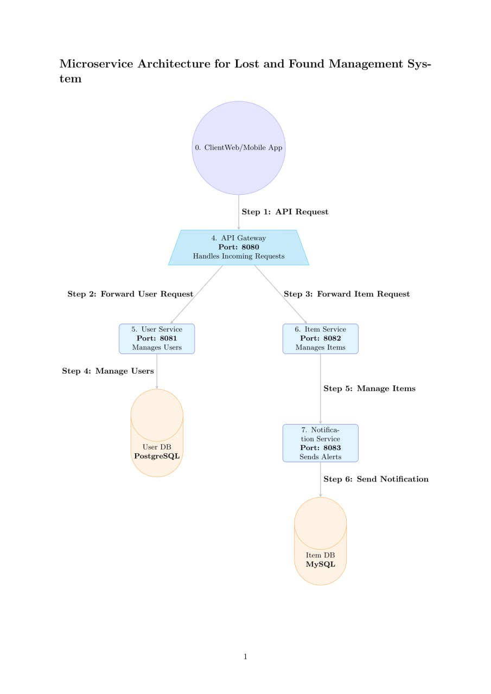

# Lost and Found Management system

## Introduction

The **Lost and Found Management System** is a microservices-based application designed to help individuals report and manage lost and found items efficiently. By leveraging a scalable architecture, this system aims to connect users who have lost items with those who have found them, facilitating easy communication and resolution.

## Project Overview

This project is developed as part of our software engineering course, focusing on the principles of distributed systems and microservices architecture. Our team is committed to applying theoretical concepts to create a practical solution for a common real-world problem.

### Objectives

- **Scalability**: The system is designed to handle a large number of users and items efficiently.
- **Reliability**: By implementing fault tolerance and robust communication methods, we aim to ensure consistent service availability.
- **Asynchronous Processing**: Utilizing tools like RabbitMQ and Celery, the system can manage tasks without blocking user interactions.
- **Team Collaboration**: This project enhances our teamwork and collaboration skills as we work together to build a comprehensive solution.

## Microservices

The application consists of three main microservices:

1. **User Service**: Manages user accounts, authentication, and user profiles.
2. **Item Service**: Handles the management of lost and found items, including reporting, searching, and updating item statuses.
3. **Notification Service**: Sends notifications to users regarding items that match their search criteria or updates on reported items.
## Microservices Architecture

## Technologies Used

- **Django REST Framework**: For building the APIs.
- **PostgreSQL and MySQL**: For persistent data storage.
- **RabbitMQ**: For inter-service communication.

- # Microservices Overview

---

## **1. User Management Service**

**Port:** `8000`  
**Responsibilities:**  
- Manage user registration and authentication.  
- Handle user profile updates.  
- Provide secure JWT-based authentication.

**Key Features:**  
- CRUD operations for user accounts.  
- JWT token generation for secure authentication.  
- Profile management.

**Database Entities:**  
- `Users`

**APIs:**  
- `POST /users/register`: Register a new user.  
- `POST /users/login`: Login user and retrieve a JWT token.  
- `GET /users/profile`: Retrieve user profile information.  
- `PUT /users/profile`: Update user profile.

---

## **2. Item Management Service**

**Port:** `8001`  
**Responsibilities:**  
- Manage lost and found item records.  
- Allow search and filtering of items.  
- Match lost items with found items.

**Key Features:**  
- CRUD operations for items.  
- Filtering by item type, date, and location.  
- Matching logic for lost and found items.

**Database Entities:**  
- `Items`  
- `ItemCategories`

**APIs:**  
- `POST /items`: Report a new lost or found item.  
- `GET /items/<id>`: Retrieve item details by ID.  
- `PUT /items/<id>`: Update item information by ID.  
- `DELETE /items/<id>`: Delete an item by ID.  
- `GET /items/search?type=<type>&location=<location>`: Search for items by type and location.

---

## **3. Notification Service**

**Port:** `8002`  
**Responsibilities:**  
- Handle notifications for item matches.  
- Send email or SMS alerts to users.

**Key Features:**  
- Asynchronous notifications for matched items.  
- Integration with external services (e.g., email/SMS).

---

## Deployment Notes
1. Each service runs on its designated port and is developed independently.  
2. Test the APIs using tools like **Postman** or **curl**.  
3. Use a persistent database (e.g., SQLite, PostgreSQL) for real-world scenarios.  
4. Consider inter-service communication using RESTful APIs or message brokers (e.g., RabbitMQ).  

**Specifications:**
---
<table>
  <thead>
    <tr>
      <th>No</th>
      <th>Micro-service</th>
      <th>Responsibilities</th>
      <th>Key Features</th>
      <th>Database Entities</th>
      <th>APIs</th>
    </tr>
  </thead>
  <tbody>
    <tr>
      <td>1</td>
      <td>User Management Service (Port 8000)</td>
      <td>
        - Manage user registration and authentication. 
        - Handle user profile updates. 
        - Provide secure JWT-based authentication.
      </td>
      <td>
        - CRUD operations for user accounts. 
        - JWT token generation for authentication. 
        - Profile management.
      </td>
      <td>Users</td>
      <td>
        <ul>
          <li>POST /users/register: Register a new user.</li>
          <li>POST /users/login: Login user.</li>
          <li>GET /users/profile: Retrieve user profile.</li>
          <li>PUT /users/profile: Update user profile.</li>
        </ul>
      </td>
    </tr>
    <tr>
      <td>2</td>
      <td>Item Management Service (Port 8001)</td>
      <td>
        - Manage lost and found item records. 
        - Allow search and filtering of items. 
        - Match lost items with found items.
      </td>
      <td>
        - CRUD operations for items. 
        - Filtering by item type, date, and location. 
        - Matching logic for lost and found items.
      </td>
      <td>Items, ItemCategories</td>
      <td>
        <ul>
          <li>POST /items: Report a new lost or found item.</li>
          <li>GET /items/id: Retrieve item details.</li>
          <li>PUT /items/id: Update item information.</li>
          <li>DELETE /items/id: Delete an item.</li>
          <li>GET /items/search?type=lost&location=city: Search for items by type and location.</li>
        </ul>
      </td>
    </tr>
    <tr>
      <td>3</td>
      <td>Notification Service (Port 8002)</td>
      <td>
        - Handle notifications for item matches. 
        - Send email alerts to users.
      </td>
      <td>
        - Asynchronous notifications for matched items. 
        - Integration with external services (e.g., email).
      </td>
      <td></td>
      <td></td>
        
      
  </tbody>
</table>
